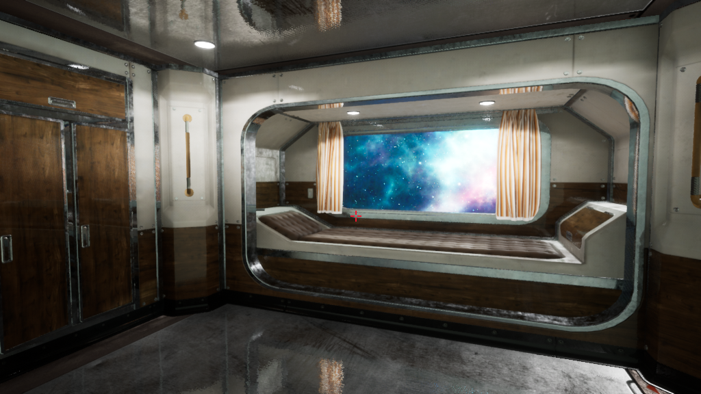

# The Game's Map

## The Places

This is a list of places of the game's map. Each location is identified with a numerical ID and a name. For each location, you can also read a small description and see some screenshots (if the place has already been created).

<dl>
    <dt>01: The Cockpit</dt>
    <dd>
        <figure>
            <!--<figcaption>The player's cabin</figcaption>
            -->
        </figure>
    </dd>
    <dt>02: Corridor's End</dt>
    <dd>
        <figure>
            <!--<figcaption>The player's cabin</figcaption>
            -->
        </figure>
    </dd>
    <dt>03: The Corridor</dt>
    <dd>
        <figure>
            <!--<figcaption>The player's cabin</figcaption>
            -->
        </figure>
    </dd>
    <dt>04: Corridor's End</dt>
    <dd>
        <figure>
            <!--<figcaption>The player's cabin</figcaption>
            -->
        </figure>
    </dd>
    <dt>05: The Second Pilot's Cabin</dt>
    <dd>
        <figure>
            <!--<figcaption>The player's cabin</figcaption>
            -->
        </figure>
    </dd>
    <dt>06: The Cabin</dt>
    <dd>
        <figure>
            <figcaption>The player's cabin. It's the game starting point.</figcaption>
            
        </figure>
    </dd>
    <dt>07: The Tin Compartment</dt>
    <dd>
        <figure>
            <!--<figcaption>The player's cabin</figcaption>
            -->
        </figure>
    </dd>
    <dt>08: The Reactor Controls Room</dt>
    <dd>
        <figure>
            <!--<figcaption>The player's cabin</figcaption>
            -->
        </figure>
    </dd>
    <dt>09: Outside &ndash; Bow of the Ship</dt>
    <dd>
        <figure>
            <!--<figcaption>The player's cabin</figcaption>
            -->
        </figure>
    </dd>
    <dt>10: Outside</dt>
    <dd>
        <figure>
            <!--<figcaption>The player's cabin</figcaption>
            -->
        </figure>
    </dd>
    <dt>11: Outside &ndash; Stern of the Ship</dt>
    <dd>
        <figure>
            <!--<figcaption>The player's cabin</figcaption>
            -->
        </figure>
    </dd>
</dl>

## The Graph
<figure>
    <figcaption>
        <strong>Legend:</strong> 
        <ul>
            <li>A solid line means that the direction can be taken at any time.</li>
            <li>A dashed line means that the direction can be taken if certain conditions are met.</li>
            <li>
                The arrow represent the direction. Unless explicitly stated, the directions are the followings:
                <ul>
                    <li><strong>North</strong>: up</li>
                    <li><strong>East</strong>: right</li>
                    <li><strong>South</strong>: down</li>
                    <li><strong>West</strong>: left</li>
                </ul>
            </li>
            <li>If the arrow has a label, that label is referred to the nearest arrow tip. A label can contain the direction of the line or a condition that must be met to follow the line.</li>
        </ul>
    </figcaption>
    
</figure>